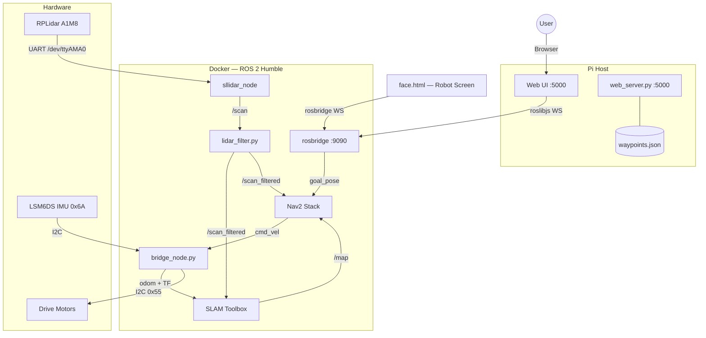

# Walter — Autonomous Delivery Robot

Walter is a ROS 2 Humble-powered differential-drive robot built for autonomous room mapping and table delivery. It runs on a Raspberry Pi 4 with an RPLidar A1M8 (UART), IMU (I2C), and I2C motor controller, all orchestrated through a single boot command.

---

## System Architecture



---

## File Overview

| File | Runs on | Purpose |
|---|---|---|
| `run_walter.sh` | Pi host | Powers LiDAR GPIO, launches Docker |
| `start_brain.sh` | Docker | Staged startup: LiDAR → SLAM → Nav2 |
| `bridge_node.py` | Docker | Motors + IMU + odometry at 50 Hz |
| `lidar_filter.py` | Docker | Blanks mount-obstruction blind spots |
| `roomba_mapper.py` | Docker | Autonomous room exploration |
| `save_map.sh` | Docker | Saves SLAM map to `maps/` |
| `slam_params.yaml` | Docker | SLAM Toolbox config |
| `config/nav2_params.yaml` | Docker | Nav2 stack config |
| `web_server.py` | Pi host | Flask API + serves UI (port 5000) |
| `static/index.html` | Browser | Delivery UI — send Walter to tables |
| `static/admin.html` | Browser | Admin — place table markers on map |
| `static/drive.html` | Browser | Keyboard teleoperation with adjustable speed |
| `static/face.html` | Robot screen | Animated eyes that react to robot state |
| `waypoints.json` | Pi host | Named table coordinates (auto-created) |

---

## Quick Start

### 1 — One-command boot
```bash
# On the Pi, from the walter_bot directory:
./run_walter.sh
```
This powers the LiDAR (GPIO 17), waits for spin-up, then starts Docker with the full ROS 2 stack.

### 2 — Map the room
```bash
# In the running Docker container:
python3 roomba_mapper.py
```
Walter explores autonomously. Press `Ctrl+C` to stop early. When done:
```bash
bash save_map.sh          # saves maps/room_map.pgm + .yaml
```

### 3 — Start the web server
```bash
# On the Pi host (outside Docker):
pip3 install flask
python3 web_server.py
```

### 4 — Open the UI
| URL | Purpose |
|---|---|
| `http://<pi-ip>:5000/` | Delivery UI |
| `http://<pi-ip>:5000/admin` | Place table markers on map |
| `http://<pi-ip>:5000/static/drive.html` | Keyboard teleoperation |
| `http://<pi-ip>:5000/static/face.html` | Robot face screen |

---

## ROS 2 Topic Map

| Topic | Type | Direction |
|---|---|---|
| `/scan` | `LaserScan` | LiDAR → filter |
| `/scan_filtered` | `LaserScan` | filter → SLAM, Nav2 |
| `/odom` | `Odometry` | bridge → SLAM, Nav2 |
| `/imu/data_raw` | `Imu` | bridge → (optional) |
| `/map` | `OccupancyGrid` | SLAM → Nav2, UI |
| `/cmd_vel` | `Twist` | Nav2 → bridge |
| `/goal_pose` | `PoseStamped` | UI → Nav2 |
| `/walter/face` | `String` | Python scripts → face screen |

---

## Hardware

| Component | Interface | Address / Port |
|---|---|---|
| RPLidar A1M8 | UART | `/dev/ttyAMA0` @ 115200 |
| Motor controller | I2C | `0x55` |
| LSM6DS IMU | I2C | `0x6A` |
| LiDAR power | GPIO | Pin 17 |
| Load cell (future) | SPI | `spidev0.0` |

---

## Key Design Decisions

**`use_sim_time: False` everywhere** — the single most common Nav2 failure cause on real hardware. All nav2_params.yaml nodes must have this or they silently wait for `/clock` forever.

**UART not USB** — The RPLidar A1M8 connects to `/dev/ttyAMA0` (Pi hardware serial), not `/dev/ttyUSB0`. Requires disabling the serial login shell in `raspi-config` while keeping the hardware UART enabled.

**No AMCL** — SLAM Toolbox handles both mapping and localization. AMCL is removed from nav2_params.yaml to avoid conflicts.

**No reverse** — `min_vel_x: 0.0` in DWB planner. Walter rotates in place instead of reversing.

**Outside-Docker web server** — `web_server.py` runs on the Pi host so it can access GPIO, SPI, and I2C hardware directly (load cell, battery gauge) without breaking Docker networking.

**`/walter/face` topic** — Publish any of `idle`, `moving`, `arrived`, `waiting`, `returning`, `error` as a `std_msgs/String` from any Python node to update the robot's face expression.

**Keyboard drive uses teleop_twist_keyboard speed model** — WASD / arrow keys move at the currently configured speed. `Q`/`Z` scale both speeds by ±10%, `=`/`-` adjust linear only, `E`/`C` angular only. Speed persists between key presses. Space or K is emergency stop. Publishes `/cmd_vel` at 10 Hz continuously so Nav2's watchdog does not trigger.
