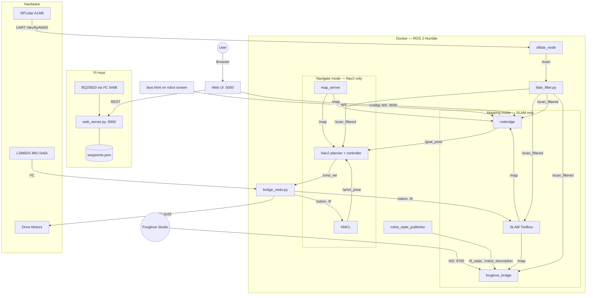

# Walter — Autonomous Delivery Robot

Walter is a ROS 2 Humble differential-drive robot built for **autonomous room mapping and table delivery**. It runs entirely on a Raspberry Pi 4: LiDAR over UART, IMU and motor controller over I²C, a Flask web UI on the Pi host, and the full ROS 2 stack inside a single Docker container.

A single command boots the whole thing — there are no external dependencies, no cloud services, and no manual `roslaunch` invocations.

> **Looking for how to use it?** This file describes **what Walter is** and **how it's wired together**. For step-by-step procedures (mapping, navigation, drift tests, calibration, etc.) see **[SETUP.md](SETUP.md)**.

---

## What Walter does

| In a nutshell | |
|---|---|
| **Mapping** | Drive it around a room manually, watch the occupancy grid build live in the browser, save the map. |
| **Navigation** | Place named tables and zones on the saved map, then tap a button — Walter plans a path, drives there, waits, comes back. |
| **Drift testing** | Automated and interactive scripts for measuring sensor / encoder accuracy. |
| **Hardware monitoring** | Live battery (BQ25820), LiDAR, IMU, odom and load-cell readouts in the UI. |

---

## System Architecture

### Two operating modes — mutually exclusive

| Mode | What runs | Purpose |
|---|---|---|
| **Mapping** | LiDAR + bridge + SLAM Toolbox | Build the room map manually. SLAM Toolbox accumulates an occupancy grid from filtered LiDAR scans and publishes `/map` every ~8 s. |
| **Navigate** | LiDAR + bridge + map_server + AMCL + Nav2 | Production. AMCL localises the robot against the saved map, Nav2 plans paths and drives. |

`run_walter.sh` auto-detects which mode to start based on whether `maps/room_map.yaml` exists. **SLAM and Nav2 never run together** — this is intentional; SLAM alone uses enough RAM and CPU on a Pi 4 that running both kills performance.

### Two bridges

| Bridge | Port | Audience | Topic exposure |
|---|---|---|---|
| `rosbridge_websocket` | 9090 | Web UI (map.html, drive.html, logs.html, ...) | All topics (the UI needs `/odom`, `/cmd_vel`, `/imu/data_raw` in addition to the 4 user-facing ones) |
| `foxglove_bridge` | 8765 | Foxglove Studio | **Whitelisted** to only `/scan`, `/scan_filtered`, `/map`, `/tf`, `/tf_static`, `/robot_description` — keeps the panel list clean |

---

## ROS 2 Topic Map

| Topic | Type | Published by | Consumed by | QoS |
|---|---|---|---|---|
| `/scan` | `LaserScan` | sllidar_node | lidar_filter | BEST_EFFORT |
| `/scan_filtered` | `LaserScan` | lidar_filter | SLAM / Nav2 / UI | BEST_EFFORT |
| `/odom` | `Odometry` | bridge_node | SLAM / AMCL / UI | RELIABLE |
| `/imu/data_raw` | `Imu` | bridge_node | UI / drift tests | RELIABLE |
| `/map` | `OccupancyGrid` | SLAM (mapping) / map_server (navigate) | Nav2 / UI | **TRANSIENT_LOCAL + RELIABLE** — subscribers must match or they get nothing |
| `/cmd_vel` | `Twist` | Nav2 / UI / teleop | bridge_node | RELIABLE |
| `/goal_pose` | `PoseStamped` | UI | Nav2 | RELIABLE |
| `/amcl_pose` | `PoseWithCovarianceStamped` | AMCL (navigate only) | UI | RELIABLE |
| `/tf`, `/tf_static` | `TFMessage` | bridge_node + RSP | everything | mixed |
| `/robot_description` | `String` | robot_state_publisher | Foxglove | TRANSIENT_LOCAL |
| `/walter/face` | `String` | any node | face.html | RELIABLE |

---

## Hardware

| Component | Interface | Address / Port |
|---|---|---|
| RPLidar A1M8 | UART | `/dev/ttyAMA0` @ 115200 |
| ESP32 motor controller | I²C | `0x55` |
| LSM6DS IMU (mounted vertically — see `forward_return.py`) | I²C | `0x6A` |
| **BQ25820 battery charger / monitor** | I²C | `0x6B` |
| LiDAR power switch | GPIO | Pin 17 (`pinctrl set 17 op dh`) |
| Load cell ADC | SPI | CE0 (`/dev/spidev0.0`) — manual CS on GPIO 8 |
| Battery | 8 S Li-ion | 24 V (empty) → 32 V (full) |

---

## File Overview

### Core runtime

| File | Runs on | Purpose |
|---|---|---|
| `run_walter.sh` | Pi host | One-command boot: GPIO power → web server → Docker |
| `start_brain.sh` | Docker | Staged ROS 2 startup; picks mapping vs navigate mode |
| `bridge_node.py` | Docker | Motor control + IMU + wheel odometry at 50 Hz |
| `lidar_filter.py` | Docker | Masks mount-obstruction blind spots, optional forward-arc gate |
| `web_server.py` | Pi host | Flask REST API + serves static UI on :5000 + BQ25820 polling |
| `save_map.sh` | Docker | Calls SLAM Toolbox's save service, writes `.pgm` + `.yaml` |
| `slam_params.yaml` | Docker | SLAM Toolbox config (Pi-tuned: reduced search space, halved stack) |
| `config/nav2_params.yaml` | Docker | Full Nav2 stack config |

### Diagnostic / utility scripts

| File | Purpose |
|---|---|
| `diagnose_map.sh` | Walks the `/scan → filter → /scan_filtered → SLAM → /map` chain with PASS/FAIL output |
| `drift_test.py` | Automated 1 m → 180° → 1 m drift test with IMU calibration and CSV output |
| `forward_return.py` | Interactive: drive forward, press ENTER to return; reports position drift |
| `ibat_logger.py` | Logs battery current from BQ25820 to CSV at 1 Hz |
| `lidar_diag.py` | Standalone LiDAR diagnostics |
| `roomba_mapper.py` | Autonomous random-walk mapping helper |
| `load_cell_test.py` | SPI ADC test + calibration wizard for tray load cells |
| `power_consumption_cli.py` | Live power-draw monitor |
| `qr_test.py` | QR code readability tester for table stickers |

### UI

| File | Browser path | Use when |
|---|---|---|
| `static/index.html` | `/` | Launcher with battery widget — start here |
| `static/map.html` | `/static/map.html` | **Mapping** — watch the map build live, drive manually |
| `static/editor.html` | `/static/editor.html` | Either mode — place tables / zones / origin |
| `static/delivery.html` | `/static/delivery.html` | **Navigate** — send Walter to a table |
| `static/drive.html` | `/static/drive.html` | Either mode — keyboard / d-pad teleop |
| `static/face.html` | `/static/face.html` | Robot's attached screen (animated eyes) |
| `static/logs.html` | `/static/logs.html` | Live LiDAR / odom / IMU / battery gauges |

---

## Key design decisions

**Mapping and navigate modes are separate processes.** SLAM is heavy; it runs only during the one-time mapping phase. Production uses the lightweight AMCL + map_server combo. This decision roughly halved peak RAM usage on the Pi 4.

**`run_walter.sh` auto-detects the mode.** If `maps/room_map.yaml` exists → navigate. Otherwise → mapping. No flags needed in daily use.

**Web server runs on the Pi host, not in Docker.** Because it needs direct access to GPIO, SPI and I²C (for the battery monitor at 0x6B). It proxies `docker exec` calls when it needs to talk to ROS-side scripts (like `save_map.sh`).

**Two bridges, two audiences.** rosbridge stays open for the web UI; foxglove_bridge is whitelisted to keep the Foxglove panel list focused on the 4 things you actually want to look at.

**LiDAR filter sits in the middle, not at the edge.** `/scan` is what the raw driver publishes; `/scan_filtered` is what SLAM and Nav2 consume. This separation means the unfiltered scan is still available to the UI for visualisation, while the algorithm-facing topic has the robot's own body / mounts masked out.

**`use_sim_time: False` everywhere.** The single most common Nav2 failure on real hardware. If even one node has `use_sim_time: True`, it silently waits for `/clock` forever and nothing publishes.

**No reverse in Nav2.** `min_vel_x: 0.0` in the DWB planner. Walter rotates in place instead of backing up — safer in tight spaces.

**SLAM params tuned for Pi 4.** Reduced `loop_search_space_dimension` to 2.5 m, halved `stack_size_to_use`, disabled `enable_interactive_mode`, raised `map_update_interval` to 8 s to flatten the CPU spike.

**Map QoS is TRANSIENT_LOCAL + RELIABLE.** SLAM Toolbox and map_server both publish `/map` this way. Any subscriber that uses VOLATILE (the rosbridge JS default) silently gets nothing. The web UI's `map.html` opens the subscription manually with the correct QoS via raw WebSocket; Foxglove negotiates it automatically.

**IMU is mounted vertically.** Raw odom yaw reads at 2× actual physical rotation. `forward_return.py` documents and compensates for this with a `YAW_SCALE = 2.0` constant.

**No reliance on USB.** Lidar is UART (`/dev/ttyAMA0`), so the Pi's USB ports stay free for the keyboard / debug console.

---

## Next steps

For everything operational — building a map, running deliveries, calibrating sensors, viewing in Foxglove — go to **[SETUP.md](SETUP.md)**.
