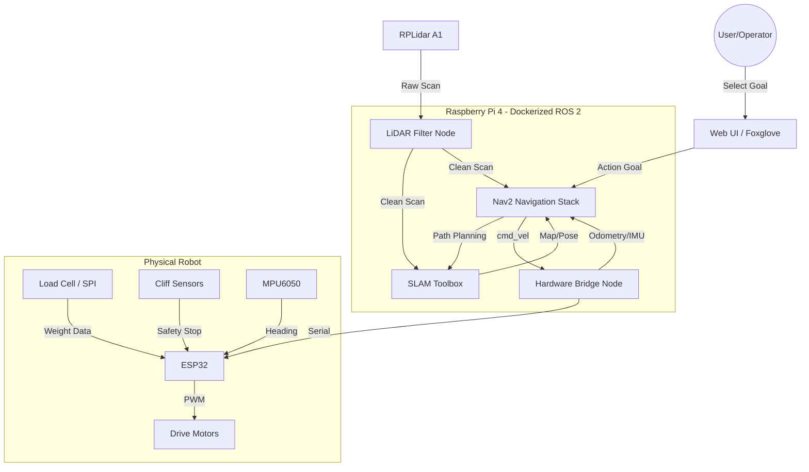
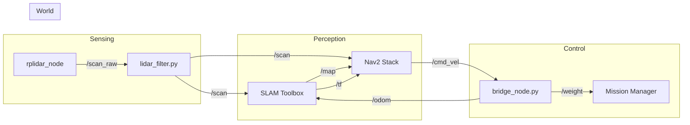

# 🤖 Project Walter: Autonomous Service Robot

Walter is a ROS 2 Humble-powered service robot built for autonomous mapping, navigation, and weight-sensitive delivery. It runs on a Raspberry Pi 4 with an RPLidar A1 for sensing, and uses a **staggered-boot architecture** to work around RPi 4 USB power limits. Hardware control is handled by a **Dual-Processor HAL** (Hardware Abstraction Layer) built around an ESP32.

---

## System Architecture

### High-Level Overview

This diagram shows the physical and logical flow from the operator down to the motors.



### Low-Level ROS 2 Node Graph



---

## Setup & Installation

### Build the Docker Image

```bash
docker build -t walter_dev .
```

### Run the Container

```bash
docker run -it --rm \
  --name walter_dev \
  --privileged \
  --network host \
  -v $(pwd):/ros2_ws \
  walter_dev
```

---

## Launch Sequence

### Terminal 1 — LiDAR

```bash
docker exec -it walter_dev bash
ros2 run sllidar_ros2 sllidar_node \
  --ros-args \
  -p serial_port:=/dev/ttyUSB0 \
  -p serial_baudrate:=115200 \
  -p frame_id:=laser_frame \
  -p angle_compensate:=true \
  -p scan_mode:=Standard
```

### Terminal 2 — Core Brain

```bash
docker exec -it walter_dev bash
./start_brain.sh
```

### Terminal 3 — Nav2 Navigation Stack

```bash
docker exec -it walter_dev bash
ros2 launch nav2_bringup navigation_launch.py \
  use_sim_time:=False \
  autostart:=True \
  params_file:=/ros2_ws/config/nav2_params.yaml
```

### Terminal 4 — Mapper

```bash
docker exec -it walter_dev bash
python3 roomba_mapper.py
```

---

## Key Design Decisions

**No Reverse**
Walter is configured in `nav2_params.yaml` with `min_vel_x: 0.0`. He will only move forward or rotate in place — no reversing.

**Staggered Boot**
The LiDAR node is launched first (Terminal 1) before SLAM Toolbox starts. This prevents the `80008002` USB power error on the RPi 4, which occurs when the LiDAR and SLAM both spike power demand simultaneously at startup.

**Hardware-Level Safety**
Cliff detection runs entirely on the ESP32, independent of ROS. If a cliff is detected, the ESP32 immediately cuts motor power — no ROS command can override this.
