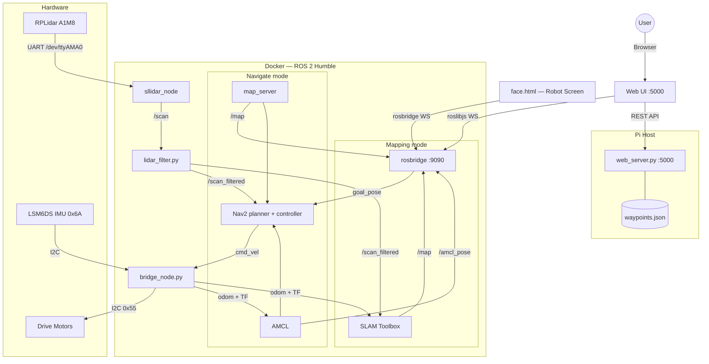

# Walter — Autonomous Delivery Robot

Walter is a ROS 2 Humble-powered differential-drive robot built for autonomous room mapping and table delivery. It runs on a Raspberry Pi 4 with an RPLidar A1M8 (UART), IMU (I2C), and I2C motor controller. A single command boots everything.

---

## System Architecture



### Two operating modes

| Mode | When | What runs | Purpose |
|---|---|---|---|
| **Mapping** | No saved map found | LiDAR + bridge + SLAM Toolbox only | Build the room map manually |
| **Navigate** | Saved map exists | LiDAR + bridge + map_server + AMCL + Nav2 | Production — autonomous delivery |

`run_walter.sh` picks the mode automatically. SLAM and Nav2 **never run together** — this is intentional to avoid memory conflicts on the Pi.

---

## File Overview

| File | Runs on | Purpose |
|---|---|---|
| `run_walter.sh` | Pi host | One-command boot: GPIO → web server → Docker |
| `start_brain.sh` | Docker | Staged startup for mapping or navigate mode |
| `bridge_node.py` | Docker | Motors + IMU + odometry at 50 Hz |
| `lidar_filter.py` | Docker | Blanks mount-obstruction blind spots |
| `save_map.sh` | Docker | Saves SLAM map to `maps/` |
| `slam_params.yaml` | Docker | SLAM Toolbox tuning (Pi-optimised) |
| `config/nav2_params.yaml` | Docker | Nav2 stack config |
| `web_server.py` | Pi host | Flask REST API + serves static UI on port 5000 |
| `load_cell_test.py` | Pi host | SPI ADC test + calibration wizard for load cells |
| `waypoints.json` | Pi host | Named table/zone coordinates (auto-created) |
| `static/index.html` | Browser | Launcher — links to all tools |
| `static/map.html` | Browser | Live map view + manual drive + edit during mapping |
| `static/editor.html` | Browser | Place tables, zones and origin on a saved map |
| `static/delivery.html` | Browser | Send Walter to a table autonomously |
| `static/drive.html` | Browser | Keyboard / d-pad teleoperation |
| `static/face.html` | Robot screen | Animated eyes that react to robot state |
| `static/logs.html` | Browser | Live sensor gauges — LiDAR, odom, IMU, cmd\_vel |

---

## Quick Start

### 1 — One-command boot

```bash
# On the Pi, from the walter_bot directory:
./run_walter.sh
```

- Powers LiDAR via GPIO 17, waits for spin-up
- Starts `web_server.py` on port 5000 in the background
- **Auto-detects mode**: if `maps/room_map.yaml` exists → navigate mode, otherwise → mapping mode
- Launches the Docker container with the appropriate ROS 2 stack

Override the mode explicitly:

```bash
./run_walter.sh mapping          # force mapping (build a new map)
./run_walter.sh navigate         # force navigate with room_map
./run_walter.sh navigate my_map  # navigate with a specific saved map
```

### 2 — Open the UI

Navigate to `http://<pi-ip>:5000/` — the launcher shows all available tools.

| Page | URL | Use when |
|---|---|---|
| Launcher | `/` | Starting point |
| Map | `/static/map.html` | **Mapping mode** — drive + watch the map build |
| Editor | `/static/editor.html` | Either mode — place tables and zones |
| Delivery | `/static/delivery.html` | **Navigate mode** — send Walter to a table |
| Drive | `/static/drive.html` | Either mode — keyboard / d-pad control |
| Face | `/static/face.html` | Robot's attached screen (open in new tab) |
| Logs | `/static/logs.html` | Live sensor data for debugging |

### 3 — Build a map (first time)

1. Start with `./run_walter.sh` — auto-starts in mapping mode since no map exists yet
2. Open `http://<pi-ip>:5000/static/map.html`
3. Drive Walter around the room using the d-pad (or Drive page on another tab)
4. Watch the map build live — LiDAR scan points and obstacle edges appear as you drive
5. When all walls and obstacles are visible, click **Save Map** in the UI  
   (Map also auto-saves every 2 minutes and on Ctrl+C)
6. Restart Walter — it will auto-detect the saved map and start in navigate mode

### 4 — Place tables and zones

1. Start Walter (navigate mode — map already saved)
2. Open `http://<pi-ip>:5000/static/editor.html`
3. The saved map appears; click to place waypoints:
   - **Table** — numbered table with dimensions (width × depth)
   - **Zone** — named area (kitchen, bar, etc.)
   - **Origin** — robot home / return position
4. Drag any marker to reposition; click to edit label/dimensions
5. Changes save automatically to `waypoints.json`

### 5 — Deliver

1. Open `http://<pi-ip>:5000/static/delivery.html`
2. Tap a table button, then tap **Send Walter**
3. Walter navigates autonomously, waits at the table, then returns home
4. Tap **Cancel** at any time to stop

---

## Web UI Pages

### Map (`map.html`)
Available in mapping mode. Shows the live occupancy grid from SLAM Toolbox with:
- **LiDAR scan overlay** — real-time point cloud coloured by distance
- **Obstacle edge detection** — blue highlight on occupied cells adjacent to free space
- **Frontal distance** — closest point in the ±15° forward arc highlighted orange
- **Drive tab** — d-pad controller with speed slider
- **Edit tab** — quick waypoint placement without switching pages

### Editor (`editor.html`)
Works in both mapping and navigate modes (subscribes to `/map`, published by both SLAM and `map_server`). No SLAM or Nav2 dependency — safe to use in production.

Waypoint schema stored in `waypoints.json`:
```json
{
  "Table 1": { "x": 1.2, "y": -0.5, "theta": 0.0, "label": "Table 1",
               "type": "table", "number": 1, "width": 0.8, "depth": 0.6 }
}
```

### Logs (`logs.html`)
Live gauges updated via rosbridge:
- `/scan` — point count, min/max/mean range
- `/odom` — linear and angular velocity
- `/imu/data_raw` — linear acceleration X/Y/Z
- `/cmd_vel` — commanded velocity

### Face (`face.html`)
Animated robot eyes. Reacts to `/cmd_vel` automatically:

| State | Colour | Trigger |
|---|---|---|
| Idle | Blue | No movement |
| Moving | Orange | Linear velocity |
| Turning | Purple | Angular velocity only |
| Arrived | Green (pulsing) | `/walter/face` → `arrived` |
| Error | Red | `/walter/face` → `error` |

Trigger from any node or the shell:
```bash
docker exec -it walter_dev bash -c "
  source /opt/ros/humble/setup.bash &&
  ros2 topic pub --once /walter/face std_msgs/String '{data: arrived}'
"
```

---

## ROS 2 Topic Map

| Topic | Type | Published by | Consumed by |
|---|---|---|---|
| `/scan` | `LaserScan` | sllidar_node | lidar_filter |
| `/scan_filtered` | `LaserScan` | lidar_filter | SLAM / Nav2 / UI |
| `/odom` | `Odometry` | bridge_node | SLAM / AMCL / UI |
| `/imu/data_raw` | `Imu` | bridge_node | UI |
| `/map` | `OccupancyGrid` | SLAM (mapping) / map_server (navigate) | Nav2 / UI |
| `/cmd_vel` | `Twist` | Nav2 / UI | bridge_node |
| `/goal_pose` | `PoseStamped` | UI | Nav2 |
| `/amcl_pose` | `PoseWithCovarianceStamped` | AMCL | UI |
| `/walter/face` | `String` | any node | face.html |

---

## Hardware

| Component | Interface | Address / Port |
|---|---|---|
| RPLidar A1M8 | UART | `/dev/ttyAMA0` @ 115200 |
| Motor controller | I2C | `0x55` |
| LSM6DS IMU | I2C | `0x6A` |
| LiDAR power | GPIO | Pin 17 |
| Load cell ADC | SPI | CE0 (`/dev/spidev0.0`) — manual CS on GPIO 8 |

---

## Key Design Decisions

**Separate mapping and navigate modes** — SLAM Toolbox and Nav2 never run simultaneously. SLAM is heavy; it only runs during the one-time mapping phase. Production uses the lightweight AMCL + map_server combo. This halved peak RAM usage on the Pi.

**`run_walter.sh` auto-detects mode** — if `maps/room_map.yaml` exists, navigate mode starts automatically. No manual flags needed in daily use.

**`web_server.py` auto-started by `run_walter.sh`** — no separate terminal needed. Flask runs on the Pi host (outside Docker) so it can access GPIO/SPI/I2C and proxy `docker exec` commands.

**`/map` published in both modes** — SLAM Toolbox publishes `/map` during mapping; `map_server` republishes the saved `.pgm` during navigation. `editor.html` subscribes to `/map` and works in both modes without any SLAM dependency.

**UART not USB** — The RPLidar A1M8 connects to `/dev/ttyAMA0`. Requires disabling the serial login shell in `raspi-config` while keeping the hardware UART enabled.

**`use_sim_time: False` everywhere** — the most common Nav2 failure on real hardware. All nodes must set this or they silently wait for `/clock` forever.

**No reverse in Nav2** — `min_vel_x: 0.0` in the DWB planner. Walter rotates in place instead of reversing.

**SLAM params tuned for Pi** — reduced `loop_search_space_dimension` (2.5 m), halved `stack_size_to_use`, disabled `enable_interactive_mode`, increased `map_update_interval` to 8 s to reduce CPU spikes.

**Pointer events on d-pad** — `pointerdown`/`pointerup` instead of `touchstart`/`mousedown` for cross-device compatibility (touch screens, mouse, stylus).
